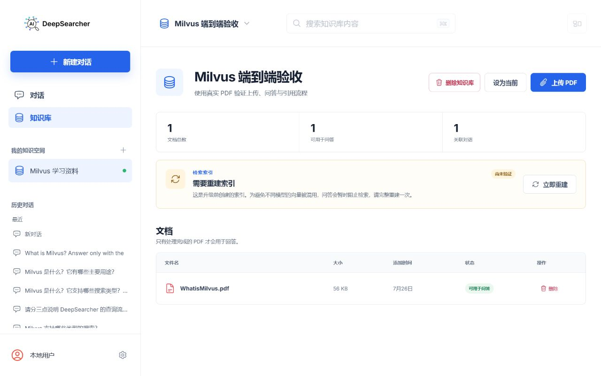
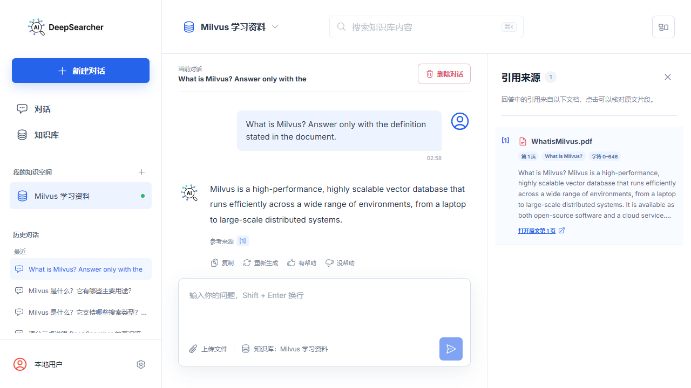

# DeepSearcher Study

> 一个独立维护的可信 RAG 研究与工程项目：以证据管理、答案核验和知识质量控制为核心。

[](LICENSE)
[](UPSTREAM.md)
[](evaluation/README.md)
[](docs/roadmap/trustworthy-rag-roadmap.md)

DeepSearcher Study 是基于 [zilliztech/deep-searcher](https://github.com/zilliztech/deep-searcher)
的 Apache-2.0 衍生项目，独立维护且不隶属于上游团队。项目保留上游许可证与归属信息，并把持续投入集中在
**可信回答、可审计证据和可复现评测**。完整来源、维护边界和同步原则见 [UPSTREAM.md](UPSTREAM.md)。

## 当前维护重点

- **Trust Layer**：将引用结构、确定性一致性、时效性、风险约束、可选语义蕴含和回答策略拆分为可版本化契约；证据不足、明确冲突或时效不明时保守降级或拒答，而不是输出虚假的确定性。
- **Evidence 与谱系**：回答中的 Claim 可定位到模型实际看到的证据片段；Trust Provenance 绑定运行时、模型、索引、证据快照和策略版本，同时排除问题正文、密钥和其他敏感原值。
- **质量评测**：检索、回答和 Trust Layer 使用版本化金标集与机器可读报告；确定性规则、Citation Span、风险分类和谱系不变量进入快速质量门禁。
- **可用产品路径**：中文学习工作台提供知识库、文档入库、带引用问答、流式进度和审计视图，并通过独立 Worker、迁移与端到端测试维护可恢复性。

## 维护证据与导航

| 你可以核验什么 | 对应材料 |
| --- | --- |
| 当前开发线的功能变更、质量边界和已知限制 | [CHANGELOG.md](CHANGELOG.md) |
| v0.3 已实现能力、后续验收条件和版本路线 | [可信 RAG 路线图](docs/roadmap/trustworthy-rag-roadmap.md) |
| 设计取舍与 fail-closed 边界 | [架构决策记录（ADR）](docs/adr/) |
| 可运行的业务、引用、风险和谱系评测 | [evaluation/README.md](evaluation/README.md) |
| 上游来源、许可与贡献原则 | [UPSTREAM.md](UPSTREAM.md) |

项目不会把实现、数据集结构校验或小样本基线包装成通用生产承诺。每项能力的适用范围、未覆盖边界和复现入口均记录在路线图、ADR 与评测文档中。

---

DeepSearcher Study 结合大语言模型与向量数据库，对私有资料执行检索、推理、证据核验与质量评估，适用于需要可追溯回答的知识管理、学习和信息检索场景。

## 当前产品界面

<p align="center">
  
  
</p>

<p align="center"><em>左：知识库、文档和索引状态治理；右：回答、引用来源与原文定位。</em></p>

## 核心能力

- **证据约束的回答**：每项事实声明绑定本次检索证据；引用结构、数字/日期/条件一致性和冲突状态独立记录。
- **可审计可信度**：风险 Profile、时效策略、Citation Span 和 Trust Provenance 让“为什么保留、降级或拒答”可追溯。
- **版本化知识治理**：文档的发布日期、生效日期、失效日期和版本系列贯穿入库、检索、Citation 与索引 Manifest。
- **可复现评测**：业务检索/回答基线与 Trust 金标集分开维护；快速门禁验证契约和回归，真实模型评测显式执行。
- **中文用户工作台**：通过本地 Milvus、持久化入库 Worker、带引用的流式问答和审计视图，提供完整的本地体验。

---

## 产品工作流

用户在工作台中创建知识库、上传并持久化处理资料，然后发起带引用的问答。回答页面会显示引用来源和
Evidence 内部定位；当证据不足、发生冲突或当前时效无法证明时，Trust Layer 会保留可审计状态并采取
保守的降级或拒答策略。详细交互与质量边界见[路线图](docs/roadmap/trustworthy-rag-roadmap.md)和
[评测说明](evaluation/README.md)。


## 📖 快速入门

下面的路径运行的是 **DeepSearcher Study 当前源码**。请不要使用 `pip install deepsearcher` 作为本项目的
安装方式：该包名会指向已发布的上游包，不能保证包含本仓库的 Trust Layer、评测和用户工作台改动。

### 前置条件

- Windows 10/11、Python 3.10+ 与 [uv](https://docs.astral.sh/uv/getting-started/installation/)；
- Docker Desktop（用于本地 Milvus）；
- Node.js 20+ 与 npm（用于构建用户工作台）；
- 至少一个与 `deepsearcher/config.yaml` 中 Provider 配置匹配的模型/Embedding API Key。

### 1. 克隆并配置本仓库

```powershell
git clone https://github.com/wyl0828/deep-searcher-study.git
Set-Location deep-searcher-study
Copy-Item env.example .env
uv sync --frozen
```

编辑 `.env`，至少填入当前 Provider 所需的密钥。当前 `deepsearcher/config.yaml` 默认使用
DeepSeek 生成模型与 OpenAI Embedding，因此需要：

```dotenv
DEEPSEEK_API_KEY=your_deepseek_api_key
OPENAI_API_KEY=your_openai_api_key
```

若切换到其他 Provider，请同时修改 `deepsearcher/config.yaml` 并填写其对应环境变量。可选的联网搜索
仅在用户为单次问题启用时使用，另需 `TAVILY_API_KEY`；未配置时系统继续只检索本地知识库。

### 2. 一键启动本地工作台

```powershell
.\start.ps1
```

启动脚本会检查依赖、启动 Milvus、构建前端，并依次运行核心 API、文档入库 Worker 与用户工作台。
默认地址是 `http://127.0.0.1:8600`；若端口冲突，脚本会选择可用端口，实际地址以 `status.ps1` 输出为准。
首次打开工作台时创建管理员账号，然后新建知识库、上传资料并发起带引用的问题。

```powershell
.\status.ps1              # 查看服务状态与实际地址
.\stop.ps1                # 停止工作台、API 和 Milvus
.\start.ps1 -SkipBuild    # 前端未改动时快速重启
```

### 3. 先验证再修改

快速质量门禁不需要真实模型或 Milvus 密钥，适合在提交前检查当前源码、评测契约和文档：

```powershell
.\scripts\run-quality-gate.ps1 -Mode Fast
```

完整评测会重建 Collection 并调用真实 Provider，运行成本与耗时更高；请先阅读
[评测说明](evaluation/README.md) 和 [质量门禁](#一键质量门禁)。

### 手动启动与 API

需要拆分部署、指定端口或调用底层 API 时，请使用后文的[手动启动](#手动启动)和
[配置说明](#configuration-details)。所有 HTTP API 都应通过服务令牌访问；不要把 API Key、服务令牌或
上传资料提交到仓库。

### Configuration Details:
#### LLM Configuration

<pre><code>config.set_provider_config("llm", "(LLMName)", "(Arguments dict)")</code></pre>
<p>The "LLMName" can be one of the following: ["DeepSeek", "OpenAI", "XAI", "SiliconFlow", "Aliyun", "PPIO", "TogetherAI", "Gemini", "Ollama", "Novita", "Jiekou.AI"]</p>
<p> The "Arguments dict" is a dictionary that contains the necessary arguments for the LLM class.</p>

<details>
  <summary>Example (OpenAI)</summary>
    <p> Make sure you have prepared your OPENAI API KEY as an env variable <code>OPENAI_API_KEY</code>.</p>
    <pre><code>config.set_provider_config("llm", "OpenAI", {"model": "o1-mini"})</code></pre>
    <p> More details about OpenAI models: https://platform.openai.com/docs/models </p>
</details>

<details>
  <summary>Example (Qwen3 from Aliyun Bailian)</summary>
    <p> Make sure you have prepared your Bailian API KEY as an env variable <code>DASHSCOPE_API_KEY</code>.</p>
    <pre><code>config.set_provider_config("llm", "Aliyun", {"model": "qwen-plus-latest"})</code></pre>
    <p> More details about Aliyun Bailian models: https://bailian.console.aliyun.com </p>
</details>


<details>
  <summary>Example (Qwen3 from OpenRouter)</summary>
    <pre><code>config.set_provider_config("llm", "OpenAI", {"model": "qwen/qwen3-235b-a22b:free", "base_url": "https://openrouter.ai/api/v1", "api_key": "OPENROUTER_API_KEY"})</code></pre>
    <p> More details about OpenRouter models: https://openrouter.ai/qwen/qwen3-235b-a22b:free </p>
</details>


<details>
  <summary>Example (DeepSeek from official)</summary>
    <p> Make sure you have prepared your DEEPSEEK API KEY as an env variable <code>DEEPSEEK_API_KEY</code>.</p>
    <pre><code>config.set_provider_config("llm", "DeepSeek", {"model": "deepseek-v4-flash"})</code></pre>
    <p> More details about DeepSeek: https://api-docs.deepseek.com/ </p>
</details>

<details>
  <summary>Example (DeepSeek from SiliconFlow)</summary>
    <p> Make sure you have prepared your SILICONFLOW API KEY as an env variable <code>SILICONFLOW_API_KEY</code>.</p>
    <pre><code>config.set_provider_config("llm", "SiliconFlow", {"model": "deepseek-ai/DeepSeek-R1"})</code></pre>
    <p> More details about SiliconFlow: https://docs.siliconflow.cn/quickstart </p>
</details>

<details>
  <summary>Example (DeepSeek from TogetherAI)</summary>
    <p> Make sure you have prepared your TOGETHER API KEY as an env variable <code>TOGETHER_API_KEY</code>.</p>
    For deepseek R1:
    <pre><code>config.set_provider_config("llm", "TogetherAI", {"model": "deepseek-ai/DeepSeek-R1"})</code></pre>
    For Llama 4:
    <pre><code>config.set_provider_config("llm", "TogetherAI", {"model": "meta-llama/Llama-4-Scout-17B-16E-Instruct"})</code></pre>
    <p> You need to install together before running, execute: <code>pip install together</code>. More details about TogetherAI: https://www.together.ai/ </p>
</details>

<details>
  <summary>Example (XAI Grok)</summary>
    <p> Make sure you have prepared your XAI API KEY as an env variable <code>XAI_API_KEY</code>.</p>
    <pre><code>config.set_provider_config("llm", "XAI", {"model": "grok-4-0709"})</code></pre>
    <p> More details about XAI Grok: https://docs.x.ai/docs/overview#featured-models </p>
</details>

<details>
  <summary>Example (Claude)</summary>
    <p> Make sure you have prepared your ANTHROPIC API KEY as an env variable <code>ANTHROPIC_API_KEY</code>.</p>
    <pre><code>config.set_provider_config("llm", "Anthropic", {"model": "claude-sonnet-4-0"})</code></pre>
    <p> More details about Anthropic Claude: https://docs.anthropic.com/en/home </p>
</details>

<details>
  <summary>Example (Google Gemini)</summary>
    <p> Make sure you have prepared your GEMINI API KEY as an env variable <code>GEMINI_API_KEY</code>.</p>
    <pre><code>config.set_provider_config('llm', 'Gemini', { 'model': 'gemini-2.0-flash' })</code></pre>
    <p> You need to install gemini before running, execute: <code>pip install google-genai</code>. More details about Gemini: https://ai.google.dev/gemini-api/docs </p>
</details>

<details>
  <summary>Example (DeepSeek from PPIO)</summary>
    <p> Make sure you have prepared your PPIO API KEY as an env variable <code>PPIO_API_KEY</code>. You can create an API Key <a href="https://ppinfra.com/settings/key-management?utm_source=github_deep-searcher">here</a>. </p>
    <pre><code>config.set_provider_config("llm", "PPIO", {"model": "deepseek/deepseek-r1-turbo"})</code></pre>
    <p> More details about PPIO: https://ppinfra.com/docs/get-started/quickstart.html?utm_source=github_deep-searcher </p>
</details>

<details>
  <summary>Example (Claude Sonnet 4.5 from Jiekou.AI)</summary>
    <p> Make sure you have prepared your Jiekou.AI API KEY as an env variable <code>JIEKOU_API_KEY</code>. You can create an API Key <a href="https://jiekou.ai/settings/key-management?utm_source=github_deep-searcher">here</a>. </p>
    <pre><code>config.set_provider_config("llm", "JiekouAI", {"model": "claude-sonnet-4-5-20250929"})</code></pre>
    <p> More details about Jiekou.AI: https://docs.jiekou.ai/docs/support/quickstart?utm_source=github_deep-searcher </p>
</details>

<details>
  <summary>Example (Ollama)</summary>
  <p> Follow <a href="https://github.com/jmorganca/ollama">these instructions</a> to set up and run a local Ollama instance:</p>
  <p> <a href="https://ollama.ai/download">Download</a> and install Ollama onto the available supported platforms (including Windows Subsystem for Linux).</p>
  <p> View a list of available models via the <a href="https://ollama.ai/library">model library</a>.</p>
  <p> Fetch available LLM models via <code>ollama pull &lt;name-of-model&gt;</code></p>
  <p> Example: <code>ollama pull qwen3</code></p>
  <p> To chat directly with a model from the command line, use <code>ollama run &lt;name-of-model&gt;</code>.</p>
  <p> By default, Ollama has a REST API for running and managing models on <a href="http://localhost:11434">http://localhost:11434</a>.</p>
  <pre><code>config.set_provider_config("llm", "Ollama", {"model": "qwen3"})</code></pre>
</details>

<details>
  <summary>Example (Volcengine)</summary>
    <p> Make sure you have prepared your Volcengine API KEY as an env variable <code>VOLCENGINE_API_KEY</code>. You can create an API Key <a href="https://console.volcengine.com/ark/region:ark+cn-beijing/apiKey">here</a>. </p>
    <pre><code>config.set_provider_config("llm", "Volcengine", {"model": "deepseek-r1-250120"})</code></pre>
    <p> More details about Volcengine: https://www.volcengine.com/docs/82379/1099455?utm_source=github_deep-searcher </p>
</details>

<details>
  <summary>Example (GLM)</summary>
    <p> Make sure you have prepared your GLM API KEY as an env variable <code>GLM_API_KEY</code>.</p>
    <pre><code>config.set_provider_config("llm", "GLM", {"model": "glm-4-plus"})</code></pre>
    <p> You need to install zhipuai before running, execute: <code>pip install zhipuai</code>. More details about GLM: https://bigmodel.cn/dev/welcome </p>
</details>

<details>
  <summary>Example (Amazon Bedrock)</summary>
    <p> Make sure you have prepared your Amazon Bedrock API KEY as an env variable <code>AWS_ACCESS_KEY_ID</code> and <code>AWS_SECRET_ACCESS_KEY</code>.</p>
    <pre><code>config.set_provider_config("llm", "Bedrock", {"model": "us.deepseek.r1-v1:0"})</code></pre>
    <p> You need to install boto3 before running, execute: <code>pip install boto3</code>. More details about Amazon Bedrock: https://docs.aws.amazon.com/bedrock/ </p>
</details>

<details>
  <summary>Example (IBM watsonx.ai)</summary>
    <p> Make sure you have prepared your watsonx.ai credentials as env variables <code>WATSONX_APIKEY</code>, <code>WATSONX_URL</code>, and <code>WATSONX_PROJECT_ID</code>.</p>
    <pre><code>config.set_provider_config("llm", "watsonx", {"model": "us.deepseek.r1-v1:0"})</code></pre>
    <p> You need to install ibm-watsonx-ai before running, execute: <code>pip install ibm-watsonx-ai</code>. More details about IBM watsonx.ai: https://www.ibm.com/products/watsonx-ai/foundation-models </p>
</details>


#### Embedding Model Configuration
<pre><code>config.set_provider_config("embedding", "(EmbeddingModelName)", "(Arguments dict)")</code></pre>
<p>The "EmbeddingModelName" can be one of the following: ["MilvusEmbedding", "OpenAIEmbedding", "VoyageEmbedding", "SiliconflowEmbedding", "PPIOEmbedding", "NovitaEmbedding", "JiekouAIEmbedding"]</p>
<p> The "Arguments dict" is a dictionary that contains the necessary arguments for the embedding model class.</p>

<details>
  <summary>Example (OpenAI embedding)</summary>
    <p> Make sure you have prepared your OpenAI API KEY as an env variable <code>OPENAI_API_KEY</code>.</p>
    <pre><code>config.set_provider_config("embedding", "OpenAIEmbedding", {"model": "text-embedding-3-small"})</code></pre>
    <p> More details about OpenAI models: https://platform.openai.com/docs/guides/embeddings/use-cases </p>
</details>

<details>
  <summary>Example (OpenAI embedding Azure)</summary>
    <p> Make sure you have prepared your OpenAI API KEY as an env variable <code>OPENAI_API_KEY</code>.</p>
    <pre><code>config.set_provider_config("embedding", "OpenAIEmbedding", {
    "model": "text-embedding-ada-002",
    "azure_endpoint": "https://<youraifoundry>.openai.azure.com/",
    "api_version": "2023-05-15"
})</code></pre>
</details>

<details>
  <summary>Example (Pymilvus built-in embedding model)</summary>
    <p> Use the built-in embedding model in Pymilvus, you can set the model name as <code>"default"</code>, <code>"BAAI/bge-base-en-v1.5"</code>, <code>"BAAI/bge-large-en-v1.5"</code>, <code>"jina-embeddings-v3"</code>, etc. <br/>
    See [milvus_embedding.py](deepsearcher/embedding/milvus_embedding.py) for more details.  </p>
    <pre><code>config.set_provider_config("embedding", "MilvusEmbedding", {"model": "BAAI/bge-base-en-v1.5"})</code></pre>
    <pre><code>config.set_provider_config("embedding", "MilvusEmbedding", {"model": "jina-embeddings-v3"})</code></pre>
    <p> For Jina's embedding model, you need<code>JINAAI_API_KEY</code>.</p>
    <p> You need to install pymilvus model before running, execute: <code>pip install pymilvus.model</code>. More details about Pymilvus: https://milvus.io/docs/embeddings.md </p>

</details>

<details>
  <summary>Example (VoyageAI embedding)</summary>
    <p> Make sure you have prepared your VOYAGE API KEY as an env variable <code>VOYAGE_API_KEY</code>.</p>
    <pre><code>config.set_provider_config("embedding", "VoyageEmbedding", {"model": "voyage-3"})</code></pre>
    <p> You need to install voyageai before running, execute: <code>pip install voyageai</code>. More details about VoyageAI: https://docs.voyageai.com/embeddings/ </p>
</details>

<details>
  <summary>Example (Amazon Bedrock embedding)</summary>
  <pre><code>config.set_provider_config("embedding", "BedrockEmbedding", {"model": "amazon.titan-embed-text-v2:0"})</code></pre>
  <p> You need to install boto3 before running, execute: <code>pip install boto3</code>. More details about Amazon Bedrock: https://docs.aws.amazon.com/bedrock/ </p>
</details>

<details>
  <summary>Example (Novita AI embedding)</summary>
    <p> Make sure you have prepared your Novita AI API KEY as an env variable <code>NOVITA_API_KEY</code>.</p>
    <pre><code>config.set_provider_config("embedding", "NovitaEmbedding", {"model": "baai/bge-m3"})</code></pre>
    <p> More details about Novita AI: https://novita.ai/docs/api-reference/model-apis-llm-create-embeddings?utm_source=github_deep-searcher&utm_medium=github_readme&utm_campaign=link </p>
</details>

<details>
  <summary>Example (Siliconflow embedding)</summary>
    <p> Make sure you have prepared your Siliconflow API KEY as an env variable <code>SILICONFLOW_API_KEY</code>.</p>
    <pre><code>config.set_provider_config("embedding", "SiliconflowEmbedding", {"model": "BAAI/bge-m3"})</code></pre>
    <p> More details about Siliconflow: https://docs.siliconflow.cn/en/api-reference/embeddings/create-embeddings </p>
</details>

<details>
  <summary>Example (Volcengine embedding)</summary>
    <p> Make sure you have prepared your Volcengine API KEY as an env variable <code>VOLCENGINE_API_KEY</code>.</p>
    <pre><code>config.set_provider_config("embedding", "VolcengineEmbedding", {"model": "doubao-embedding-text-240515"})</code></pre>
    <p> More details about Volcengine: https://www.volcengine.com/docs/82379/1302003 </p>
</details>

<details>
  <summary>Example (GLM embedding)</summary>
    <p> Make sure you have prepared your GLM API KEY as an env variable <code>GLM_API_KEY</code>.</p>
    <pre><code>config.set_provider_config("embedding", "GLMEmbedding", {"model": "embedding-3"})</code></pre>
    <p> You need to install zhipuai before running, execute: <code>pip install zhipuai</code>. More details about GLM: https://bigmodel.cn/dev/welcome </p>
</details>

<details>
  <summary>Example (Google Gemini embedding)</summary>
    <p> Make sure you have prepared your Gemini API KEY as an env variable <code>GEMINI_API_KEY</code>.</p>
    <pre><code>config.set_provider_config("embedding", "GeminiEmbedding", {"model": "text-embedding-004"})</code></pre>
    <p> You need to install gemini before running, execute: <code>pip install google-genai</code>. More details about Gemini: https://ai.google.dev/gemini-api/docs </p>
</details>

<details>
  <summary>Example (Ollama embedding)</summary>
    <pre><code>config.set_provider_config("embedding", "OllamaEmbedding", {"model": "bge-m3"})</code></pre>
    <p> You need to install ollama before running, execute: <code>pip install ollama</code>. More details about Ollama Python SDK: https://github.com/ollama/ollama-python </p>
</details>

<details>
  <summary>Example (PPIO embedding)</summary>
    <p> Make sure you have prepared your PPIO API KEY as an env variable <code>PPIO_API_KEY</code>.</p>
    <pre><code>config.set_provider_config("embedding", "PPIOEmbedding", {"model": "baai/bge-m3"})</code></pre>
    <p> More details about PPIO: https://ppinfra.com/docs/get-started/quickstart.html?utm_source=github_deep-searcher </p>
</details>

<details>
  <summary>Example (Jiekou.AI embedding)</summary>
    <p> Make sure you have prepared your Jiekou.AI API KEY as an env variable <code>JIEKOU_API_KEY</code>.</p>
    <pre><code>config.set_provider_config("embedding", "JiekouAIEmbedding", {"model": "qwen/qwen3-embedding-8b"})</code></pre>
    <p> More details about Jiekou.AI: https://docs.jiekou.ai/docs/support/quickstart?utm_source=github_deep-searcher </p>
</details>

<details>
  <summary>Example (FastEmbed embedding)</summary>
    <pre><code>config.set_provider_config("embedding", "FastEmbedEmbedding", {"model": "intfloat/multilingual-e5-large"})</code></pre>
    <p> You need to install fastembed before running, execute: <code>pip install fastembed</code>. More details about fastembed: https://github.com/qdrant/fastembed </p>
</details>


<details>
  <summary>Example (IBM watsonx.ai embedding)</summary>
    <p> Make sure you have prepared your WatsonX credentials as env variables <code>WATSONX_APIKEY</code>, <code>WATSONX_URL</code>, and <code>WATSONX_PROJECT_ID</code>.</p>
    <pre><code>config.set_provider_config("embedding", "WatsonXEmbedding", {"model": "ibm/slate-125m-english-rtrvr-v2"})</code></pre>
    <pre><code>config.set_provider_config("embedding", "WatsonXEmbedding", {"model": "sentence-transformers/all-minilm-l6-v2"})</code></pre>
    <p> You need to install ibm-watsonx-ai before running, execute: <code>pip install ibm-watsonx-ai</code>. More details about IBM watsonx.ai: https://www.ibm.com/products/watsonx-ai/foundation-models </p>
</details>

#### Vector Database Configuration
<pre><code>config.set_provider_config("vector_db", "(VectorDBName)", "(Arguments dict)")</code></pre>
<p>The "VectorDBName" can be one of the following: ["Milvus"] (Under development)</p>
<p> The "Arguments dict" is a dictionary that contains the necessary arguments for the Vector Database class.</p>

<details>
  <summary>Example (Milvus)</summary>
    <pre><code>config.set_provider_config("vector_db", "Milvus", {"uri": "./milvus.db", "token": ""})</code></pre>
    <p> More details about Milvus Config:</p>
    <ul>
        <li>
            Setting the <code>uri</code> as a local file, e.g. <code>./milvus.db</code>, is the most convenient method, as it automatically utilizes <a href="https://milvus.io/docs/milvus_lite.md" target="_blank">Milvus Lite</a> to store all data in this file.
        </li>
    </ul>
    <ul>
      <li>
          If you have a large-scale dataset, you can set up a more performant Milvus server using 
          <a href="https://milvus.io/docs/quickstart.md" target="_blank">Docker or Kubernetes</a>. 
          In this setup, use the server URI, e.g., <code>http://localhost:19530</code>, as your <code>uri</code>. 
          You can also use any other connection parameters supported by Milvus such as <code>host</code>, <code>user</code>, <code>password</code>, or <code>secure</code>.
        </li>
    </ul>
    <ul>
        <li>
            If you want to use <a href="https://zilliz.com/cloud" target="_blank">Zilliz Cloud</a>, 
            the fully managed cloud service for Milvus, adjust the <code>uri</code> and <code>token</code> 
            according to the <a href="https://docs.zilliz.com/docs/on-zilliz-cloud-console#free-cluster-details" 
            target="_blank">Public Endpoint and API Key</a> in Zilliz Cloud.
        </li>
    </ul>

</details>

<details>
  <summary>Example (AZURE AI Search)</summary>
    <pre><code>config.set_provider_config("vector_db", "AzureSearch", {
    "endpoint": "https://<yourazureaisearch>.search.windows.net",
    "index_name": "<yourindex>",
    "api_key": "<yourkey>",
    "vector_field": ""
})</code></pre>
    <p> More details about Milvus Config:</p>

</details>

#### File Loader Configuration
<pre><code>config.set_provider_config("file_loader", "(FileLoaderName)", "(Arguments dict)")</code></pre>
<p>The "FileLoaderName" can be one of the following: ["PDFLoader", "TextLoader", "UnstructuredLoader"]</p>
<p> The "Arguments dict" is a dictionary that contains the necessary arguments for the File Loader class.</p>

<details>
  <summary>Example (Unstructured)</summary>
    <p>You can use Unstructured in two ways:</p>
    <ul>
      <li>With API: Set environment variables <code>UNSTRUCTURED_API_KEY</code> and <code>UNSTRUCTURED_API_URL</code></li>
      <li>Without API: Use the local processing mode by simply not setting these environment variables</li>
    </ul>
    <pre><code>config.set_provider_config("file_loader", "UnstructuredLoader", {})</code></pre>
    <ul>
      <li>Currently supported file types: ["pdf"] (Under development)</li>
      <li>Installation requirements:
        <ul>
          <li>Install ingest pipeline: <code>pip install unstructured-ingest</code></li>
          <li>For all document formats: <code>pip install "unstructured[all-docs]"</code></li>
          <li>For specific formats (e.g., PDF only): <code>pip install "unstructured[pdf]"</code></li>
        </ul>
      </li>
      <li>More information:
        <ul>
          <li>Unstructured documentation: <a href="https://docs.unstructured.io/ingestion/overview">https://docs.unstructured.io/ingestion/overview</a></li>
          <li>Installation guide: <a href="https://docs.unstructured.io/open-source/installation/full-installation">https://docs.unstructured.io/open-source/installation/full-installation</a></li>
        </ul>
      </li>
    </ul>
</details>

<details>
  <summary>Example (Docling)</summary>
    <pre><code>config.set_provider_config("file_loader", "DoclingLoader", {})</code></pre>
    <p> Currently supported file types: please refer to the Docling documentation: https://docling-project.github.io/docling/usage/supported_formats/#supported-output-formats </p>
    <p> You need to install docling before running, execute: <code>pip install docling</code>. More details about Docling: https://docling-project.github.io/docling/ </p>
</details>

#### Web Crawler Configuration
<pre><code>config.set_provider_config("web_crawler", "(WebCrawlerName)", "(Arguments dict)")</code></pre>
<p>The "WebCrawlerName" can be one of the following: ["FireCrawlCrawler", "Crawl4AICrawler", "JinaCrawler"]</p>
<p> The "Arguments dict" is a dictionary that contains the necessary arguments for the Web Crawler class.</p>

<details>
  <summary>Example (FireCrawl)</summary>
    <p> Make sure you have prepared your FireCrawl API KEY as an env variable <code>FIRECRAWL_API_KEY</code>.</p>
    <pre><code>config.set_provider_config("web_crawler", "FireCrawlCrawler", {})</code></pre>
    <p> More details about FireCrawl: https://docs.firecrawl.dev/introduction </p>
</details>

<details>
  <summary>Example (Crawl4AI)</summary>
    <p> Make sure you have run <code>crawl4ai-setup</code> in your environment.</p>
    <pre><code>config.set_provider_config("web_crawler", "Crawl4AICrawler", {"browser_config": {"headless": True, "verbose": True}})</code></pre>
    <p> You need to install crawl4ai before running, execute: <code>pip install crawl4ai</code>. More details about Crawl4AI: https://docs.crawl4ai.com/ </p>
</details>

<details>
  <summary>Example (Jina Reader)</summary>
    <p> Make sure you have prepared your Jina Reader API KEY as an env variable <code>JINA_API_TOKEN</code> or <code>JINAAI_API_KEY</code>.</p>
    <pre><code>config.set_provider_config("web_crawler", "JinaCrawler", {})</code></pre>
    <p> More details about Jina Reader: https://jina.ai/reader/ </p>
</details>

<details>
  <summary>Example (Docling)</summary>
    <pre><code>config.set_provider_config("web_crawler", "DoclingCrawler", {})</code></pre>
    <p> Currently supported file types: please refer to the Docling documentation: https://docling-project.github.io/docling/usage/supported_formats/#supported-output-formats </p>
    <p> You need to install docling before running, execute: <code>pip install docling</code>. More details about Docling: https://docling-project.github.io/docling/ </p>
</details>


### Python CLI Mode
#### Load
```shell
deepsearcher load "your_local_path_or_url"
# load into a specific collection
deepsearcher load "your_local_path_or_url" --collection_name "your_collection_name" --collection_desc "your_collection_description"
```
Example loading from local file:
```shell
deepsearcher load "/path/to/your/local/file.pdf"
# or more files at once
deepsearcher load "/path/to/your/local/file1.pdf" "/path/to/your/local/file2.md"
```
Example loading from url (*Set `FIRECRAWL_API_KEY` in your environment variables, see [FireCrawl](https://docs.firecrawl.dev/introduction) for more details*):

```shell
deepsearcher load "https://www.wikiwand.com/en/articles/DeepSeek"
```

#### Query
```shell
deepsearcher query "Write a report about xxx."
```

More help information
```shell
deepsearcher --help
```
For more help information about a specific subcommand, you can use `deepsearcher [subcommand] --help`.
```shell
deepsearcher load --help
deepsearcher query --help
```

### Deployment

#### Configure modules

You can configure all arguments by modifying [config.yaml](./config.yaml) to set up your system with default modules.
For example, set your `OPENAI_API_KEY` in the `llm` section of the YAML file.

#### Start service
The main script will run a FastAPI service with default address `localhost:8000`.

```shell
$ python main.py
```

#### Access via browser

You can open url http://localhost:8000/docs in browser to access the web service.
Click on the button "Try it out", it allows you to fill the parameters and directly interact with the API.


---

## ❓ Q&A

**Q1**: Why I failed to parse LLM output format / How to select the LLM?


**A1**: Small LLMs struggle to follow the prompt to generate a desired response, which usually cause the format parsing problem. A better practice is to use large reasoning models e.g. deepseek-r1 671b, OpenAI o-series, Claude 4 sonnet, etc. as your LLM. 

---

**Q2**: 
OSError: We couldn't connect to 'https://huggingface.co' to load this file, couldn't find it in the cached files and it looks like GPTCache/paraphrase-albert-small-v2 is not the path to a directory containing a file named config.json.
Checkout your internet connection or see how to run the library in offline mode at 'https://huggingface.co/docs/transformers/installation#offline-mode'.

**A2**: This is mainly due to abnormal access to huggingface, which may be a network or permission problem. You can try the following two methods:
1. If there is a network problem, set up a proxy, try adding the following environment variable.
```bash
export HF_ENDPOINT=https://hf-mirror.com
```
2. If there is a permission problem, set up a personal token, try adding the following environment variable.
```bash
export HUGGING_FACE_HUB_TOKEN=xxxx
```

---

**Q3**: DeepSearcher doesn't run in Jupyter notebook.

**A3**: Install `nest_asyncio` and then put this code block in front of your jupyter notebook.

```
pip install nest_asyncio
```

```
import nest_asyncio
nest_asyncio.apply()
```

---

## 🔧 Module Support

### 🔹 Embedding Models
- [Open-source embedding models](https://milvus.io/docs/embeddings.md)
- [OpenAI](https://platform.openai.com/docs/guides/embeddings/use-cases) (`OPENAI_API_KEY` env variable required)
- [VoyageAI](https://docs.voyageai.com/embeddings/) (`VOYAGE_API_KEY` env variable required)
- [Amazon Bedrock](https://docs.aws.amazon.com/bedrock/) (`AWS_ACCESS_KEY_ID` and `AWS_SECRET_ACCESS_KEY` env variable required)
- [FastEmbed](https://qdrant.github.io/fastembed/)
- [PPIO](https://ppinfra.com/model-api/product/llm-api?utm_source=github_deep-searcher) (`PPIO_API_KEY` env variable required)
- [Novita AI](https://novita.ai/docs/api-reference/model-apis-llm-create-embeddings?utm_source=github_deep-searcher&utm_medium=github_readme&utm_campaign=link) (`NOVITA_API_KEY` env variable required)
- [IBM watsonx.ai](https://www.ibm.com/products/watsonx-ai/foundation-models#ibmembedding) (`WATSONX_APIKEY`, `WATSONX_URL`, `WATSONX_PROJECT_ID` env variables required)
- [Jiekou.AI](https://jiekou.ai/?utm_source=github_deep-searcher) (`JIEKOU_API_KEY` env variable required)

### 🔹 LLM Support
- [OpenAI](https://platform.openai.com/docs/models) (`OPENAI_API_KEY` env variable required)
- [DeepSeek](https://api-docs.deepseek.com/) (`DEEPSEEK_API_KEY` env variable required)
- [XAI Grok](https://x.ai/api) (`XAI_API_KEY` env variable required)
- [Anthropic Claude](https://docs.anthropic.com/en/home) (`ANTHROPIC_API_KEY` env variable required)
- [SiliconFlow Inference Service](https://docs.siliconflow.cn/en/userguide/introduction) (`SILICONFLOW_API_KEY` env variable required)
- [PPIO](https://ppinfra.com/model-api/product/llm-api?utm_source=github_deep-searcher) (`PPIO_API_KEY` env variable required)
- [TogetherAI Inference Service](https://docs.together.ai/docs/introduction) (`TOGETHER_API_KEY` env variable required)
- [Google Gemini](https://ai.google.dev/gemini-api/docs) (`GEMINI_API_KEY` env variable required)
- [SambaNova Cloud Inference Service](https://docs.together.ai/docs/introduction) (`SAMBANOVA_API_KEY` env variable required)
- [Ollama](https://ollama.com/)
- [Novita AI](https://novita.ai/docs/guides/introduction?utm_source=github_deep-searcher&utm_medium=github_readme&utm_campaign=link) (`NOVITA_API_KEY` env variable required)
- [IBM watsonx.ai](https://www.ibm.com/products/watsonx-ai/foundation-models#ibmfm) (`WATSONX_APIKEY`, `WATSONX_URL`, `WATSONX_PROJECT_ID` env variable required)
- [Jiekou.AI](https://jiekou.ai/?utm_source=github_deep-searcher) (`JIEKOU_API_KEY` env variable required)

### 🔹 Document Loader
- Local File
  - PDF(with txt/md) loader
  - [Unstructured](https://unstructured.io/) (under development) (`UNSTRUCTURED_API_KEY` and `UNSTRUCTURED_URL` env variables required)
- Web Crawler
  - [FireCrawl](https://docs.firecrawl.dev/introduction) (`FIRECRAWL_API_KEY` env variable required)
  - [Jina Reader](https://jina.ai/reader/) (`JINA_API_TOKEN` env variable required)
  - [Crawl4AI](https://docs.crawl4ai.com/) (You should run command `crawl4ai-setup` for the first time)

### 🔹 Vector Database Support
- [Milvus](https://milvus.io/) and [Zilliz Cloud](https://www.zilliz.com/) (fully managed Milvus)
- [Qdrant](https://qdrant.tech/)

---
## 📊 Evaluation
See the [Evaluation](./evaluation) directory for more details.

`evaluation/datasets/workspace_v2.json` 当前版本为 `2.2.0`，固定仓库内 3 份 PDF 的 SHA-256，
包含 72 道中文业务题：65 道可回答、7 道无答案，其中 8 道要求跨文档证据、12 道带历史消息，
覆盖声明级引用、指代、省略和话题切换。
`python -m evaluation.retrieval_compare` 可在同一份 Milvus 混合索引上重复比较 Dense、BM25 与
Hybrid，并保存逐题 JSON/CSV、分标签质量、检索延迟、排序稳定率、融合权重、候选倍率、Dense
锚点和索引资源结构；
`python -m evaluation.benchmark` 继续比较三类 Agent 的回答要点、声明支持、引用精确率/召回率、
拒答、上下文改写、延迟和 Token。

2026-08-09 的 `2.2.0` 三重复真实检索报告中，加权 RRF 使用 Dense:BM25=`1.5:1`、`k=5`、
候选倍率 `1`，并保留 Dense 前两名。相对 Dense，Hybrid 的 MRR 从 71.16% 升至 71.53%、
Recall@8 从 83.85% 升至 87.44%、召回答案要点覆盖率从 80.66% 升至 81.84%，8 道跨文档题的
完整文档覆盖率从 25% 升至 37.5%；综合增益为 1.7133 个百分点且 P95 检索延迟满足门禁，
因此 `deepsearcher/config.yaml` 已切换为 Hybrid。旧 Dense-only 知识库必须重建后使用，且不能把
本次小型业务集外推为生产 SLO。

同日 `answer_stratified_v1` 的 24×3 真实回答报告中，三类 Agent 均零错误。NaiveRAG、
DeepSearch、ChainOfRAG 的质量分为 `0.785600/0.761980/0.774910`，平均 Tokens 为
`2987.54/15139.17/9163.46`，P95 延迟为 `27.7/223.0/74.8` 秒。DeepSearch 的无答案拒答
准确率只有 50%，未达到 75% 准入线；最终推荐 NaiveRAG 作为路由解析失败时的默认 Agent。
显式要求联网时仍由路由器选择支持 Web Search 的 DeepSearch，不受该兜底选择影响。

### 一键质量门禁

日常开发使用不依赖模型密钥或 Milvus 的快速档：

```powershell
.\scripts\run-quality-gate.ps1 -Mode Fast
```

它会顺序记录 Ruff 格式差异并执行阻断式 lint、Python 全量测试、前端测试/类型检查/生产构建、
真实 Chromium E2E、全新 SQLite 迁移、业务数据集与
三份基线报告的一致性和阈值校验、MkDocs 构建以及 `git diff --check`。结果和逐阶段日志写入
`tmp/quality-gate/latest/`。首次运行或 CI 使用 `-InstallDependencies`。

需要真实重建评测 Collection 并重跑检索、多轮和回答报告时使用：

```powershell
.\scripts\run-quality-gate.ps1 -Mode Full -OutputDir tmp/quality-gate/full
```

完整档先通过快速档，再使用 `evaluation/quality_gate.json` 中的固定样本与门槛校验新报告；
它需要本机 Milvus 和 `.env` 中的真实 Provider 配置。GitHub Actions 默认执行快速档，并上传
14 天可下载的质量日志与 JSON 结果。

---
## 🧭 用户学习工作台

仓库中的 `frontend/` 提供面向最终用户的中文学习工作台，用来管理知识库、上传资料、发起带引用的问答并查看学习记录。页面通过同源本地代理调用现有 FastAPI，不会向浏览器暴露 API Key，也不会伪造后端未返回的子查询、召回片段或内部推理 Trace。

知识库文档列表支持安全删除：系统会在确认后同步清理 Milvus 分块、本地 PDF 和产品数据库记录；历史回答中的引用文字仍会保留。正在处理的文档需等待完成后再删除。

PDF 上传采用 multipart 分块读取，服务端在读取过程中执行 20 MiB 硬限制并计算 SHA-256，
不会把整份文件或 Base64 副本放进请求内存。文件先进入随机命名的受控暂存区，通过独立进程完成
PDF 结构与页数检查后再原子落盘；最终文件名不使用用户输入或数据库 ID。默认每份 PDF 最多
500 页、每个知识库最多 200 份/512 MiB、整套本地工作台最多 2 GiB，均可通过 `env.example`
中的 `DEEPSEARCHER_*` 变量调整。

文档入库由独立 `frontend.product.worker` 处理，不再依赖 FastAPI `BackgroundTasks`。任务 ID、
租约、重试次数、下次执行时间和死信状态保存在 SQLite；Worker 异常退出后，过期租约会自动回到
队列。连接失败等可安全重复的故障按指数退避重试，响应超时等完成状态不确定的故障进入死信，
避免两个入库操作同时改写同一文档。重试前会按 SHA-256 清理同一文档的旧分块，保证最终幂等。
启动时还会清理过期暂存文件和超过保护期且没有数据库记录的孤儿 PDF。

知识库详情页也支持整体删除，并同步清理该知识库的 Milvus 集合、上传目录、文档、对话和引用；删除当前知识库后会自动切换到最近更新的其他知识库。对话页可单独删除当前对话及其消息、引用，不影响知识库、文档或向量数据。

问答链路会区分“检索成功但没有命中”和“向量检索服务故障”。Milvus 离线时，工作台会显示可恢复的系统故障并提供重试；Collection 不存在或向量维度不匹配时，会引导用户检查知识库索引，不会把这些失败伪装成“知识库没有相关资料”。

产品问答使用 POST + SSE 实时返回受控阶段：开始、上下文理解、路由、检索轮次、候选片段数、
证据核验、充分性检查和完成/错误。页面会自动滚到进度卡片并允许停止生成；这些是程序显式记录的
执行阶段，不是模型思维链。阶段事件不落库，浏览器只收到字段白名单后的统计。

连续追问不会再把最近消息拼成一大段查询。产品层分别发送当前问题和结构化历史；只有成功的用户
消息与 `grounded`/`fully_grounded` 助手回答可进入历史。核心用有界上下文判断指代或省略并生成
独立检索问题，话题切换保持原问题，模型失败或格式非法时也回退原问题。历史内容不能改变当前
Collection 范围或联网搜索开关，Trace/SSE 只暴露是否改写、历史条数和回退原因，不暴露对话正文。

最终回答要求每个事实声明使用本次证据编号（如 `[E1]`）；Trace v6 确定性校验证据编号并输出
`fully_grounded`、`partially_grounded`、`conflicting_evidence` 或 `insufficient_evidence`。
产品数据库持久化 `AnswerClaim` 与 Citation 映射；页面始终保留原始 Markdown 与代码块，并在可展开的
逐条核验区显示“已有依据/未找到依据/引用无效/证据冲突”。生成模型看到的 `wider_text` 证据窗口
会以同一编号和同一有界文本写入 Grounding，避免引用抽屉退化为不含目标事实的窄 Chunk。这能拒绝
伪造或过期证据编号，但不是语义蕴含模型，引用是否真正支持声明仍需用金标引用指标和人工抽查持续评估。

Trace v6 在此基础上提供版本化 Trust Layer：引用结构、语义蕴含、一致性、安全状态、回答策略
和去密 Trust Provenance 分别建模。当前首版强制执行引用结构与有边界的确定性一致性策略；存在精确生成证据快照时，部分有
依据的回答会删除无效或明确不一致的声明，完全无依据时转换为保守拒答，冲突证据则明确披露。可选
Entailment Checker 会批量核验确定性规则未解决的 Claim；高置信矛盾进入同一策略，unknown 则保留
并披露。安全检查仍标记为 `not_evaluated`，不会伪造置信度。路线和契约见
[`docs/roadmap/trustworthy-rag-roadmap.md`](docs/roadmap/trustworthy-rag-roadmap.md) 与
[`docs/adr/0001-trust-layer-contract.md`](docs/adr/0001-trust-layer-contract.md)。

Trust Layer 当前还会执行确定性一致性检查：Claim 中的数字/单位和显式日期必须能在其引用证据
集合中找到；肯定/否定方向只在核心命题可严格对齐时比较。明确冲突会使结构合法的 Citation Claim
降为 unsupported，并触发删除或拒答。策略前的错误 Claim 与检查详情会保留在 Trace 和消息
`trust_details` 中。该检查不等同于语义蕴含，边界见
[`docs/adr/0003-deterministic-consistency-checker.md`](docs/adr/0003-deterministic-consistency-checker.md)。
版本号、范围方向和“只有/仅/必须/除非”等显式条件也进入同一确定性检查。Consistency Checker
1.6 能区分“同时满足”和“满足任一”，阻断 AND 条件缺项、AND→OR 偷换、未支持 OR 分支和前置
条件的显式否定；还会把受控实体类别与同一子句中的数量/范围绑定，防止用“图片上限 20 MiB”
错误支持“PDF 上限 20 MiB”。回答中的今天/明天、上/下周、月、季度和年份使用请求级时钟与配置
时区换算，并要求证据给出明确绝对日期或周期；上传或编辑文档时可以声明
`published_at/effective_at/superseded_at` 与 `version_family`，只有可信来源的 `published_at` 能解释 Evidence 内的
“明天/下周”等表达，文件修改时间和上传时间不会冒充业务时间。缺少该锚点时进入 unknown 并由
策略保守删除或拒答。日期随 Worker 进入 Chunk/索引/Citation，且参与 Manifest 与 Provenance 指纹；
修改已就绪文档日期会重新排队更新索引。未知实体不会被强行推断，一层以上的混合逻辑仍交给语义核验。对应人工金标集为
`evaluation/datasets/trust_consistency_v1.json`，快速质量门禁会运行无模型评测，防止规则修改造成
静默误判。

当原问题要求“当前/现行/最新/近期”时，服务端 Freshness Classifier 会生成不含原问题的时效
Profile。当前有效版本必须满足 `effective_at <= 查询日期 < superseded_at`；最新政策按当前有效候选
中的 `effective_at` 排序，最新发布按 `published_at` 排序，并且只比较与被引用资料属于同一
`version_family` 的 Evidence。最新问题缺少系列、一次 Claim 混用多个系列、引用尚未生效、已经失效、
同系列快照中存在更新版本，或同系列候选缺少排序日期时，Claim 会被删除或拒答；其他文档系列不会
制造误拒绝。“近期”没有明确窗口时
同样不会擅自按 7 天或 30 天解释。该结论只证明最终 Evidence 快照内的时效状态，不冒充全库召回
完整性；决策与边界见
[`docs/adr/0008-freshness-policy.md`](docs/adr/0008-freshness-policy.md)。

Claim 引用现在还会保存相对于生成证据快照的精确 `citation_spans`。点击逐条核验中的引用时，
引用抽屉会直接高亮对应原文；规范化精确命中与句级近似使用不同样式，未找到可靠位置时不伪造
高亮。持久化前会复核 Evidence ID、偏移和 quote，避免污染 Trace 指向错误文本。该能力的坐标系
不同于 Citation 在原始文档中的页码/Chunk/全局字符位置，详细决策见
[`docs/adr/0004-citation-span-mapper.md`](docs/adr/0004-citation-span-mapper.md)。人工金标集
`evaluation/datasets/citation_span_v1.json` 已加入快速质量门禁。

可插拔语义核验通过 `query_settings.trust.entailment` 配置，默认关闭；原因不是功能不可用，而是当前
模型尚未完成金标阈值校准，不能默认增加额外调用和误拒答风险。Checker 使用严格 JSON 契约，不保存
自由推理文本，失败或低置信统一成为 unknown，并将实际 Token 计入线上 Trace 与离线 Benchmark。
人工金标与 live 评测入口见
[`docs/adr/0005-entailment-checker.md`](docs/adr/0005-entailment-checker.md)。

Query Risk Profile 会在服务端识别财务、制度合规、权限和健康安全类决策问题。high 风险回答必须
获得明确语义结论；涉及额度、期限、比例或剂量时，还需要至少两份 Evidence 和两个独立来源，同一
文档多个 Chunk 不会冒充多来源。客户端不能降低风险等级。契约、边界与金标见
[`docs/adr/0006-query-risk-profile.md`](docs/adr/0006-query-risk-profile.md)。

Trust Provenance 会为每次回答绑定运行时、去密配置、生成模型、Embedding、显式索引 Manifest、
Prompt、Checker、Risk 和 Policy 版本，并生成稳定摘要。产品页面可展开查看本次判断谱系；数据库
保存谱系版本与摘要，便于定位“哪次升级导致质量变化”。Collection 名称、Tenant 原值、原始问题、
完整 Prompt 和密钥不会进入谱系。动态路由在选库前标记为未绑定，选库后会合并 NaiveRAG、
ChainOfRAG 或 DeepSearch 各轮真正访问的 Manifest 并更新摘要；Collection 名称仍不会进入输出。
设计与边界见
[`docs/adr/0007-trust-trace-provenance.md`](docs/adr/0007-trust-trace-provenance.md)。

Provenance v2 还会绑定最终回答模型实际看到的 Evidence 顺序，以及每段证据的内容、来源和定位
指纹。Web Evidence 记录 Provider、trusted 状态和 snippet 快照身份，但不会把搜索片段冒充网页
全文归档。Builder 2.3 同时绑定相对时间判定所用的本地参考日期与时区、Freshness Classifier
契约版本；参考时刻保留在 Trust Trace，
谱系只保留日期、时区和指纹。Evidence 文档业务日期使用独立时间指纹，并披露是否绑定发布日期；
文档系列使用独立去密指纹并披露是否绑定，系列原值、正文、URL 与 Document ID 不进入谱系字段；
v1 历史记录仍可读取。

检索结果不会再用含义不明的统一“分数”描述所有向量库返回值。Trace v6 显式携带
`metric_type`，并将数值区分为距离、相似度或排序分；页面会同时说明“越小越近”或“越大越近”。
L2 等距离值、COSINE/IP 等相似度和 RRF 等排序分保持原生语义，不做跨指标换算或比较。

每个新索引都会保存不含密钥的版本清单，绑定 Embedding provider、模型、版本、维度、归一化方式、距离度量、分块配置和数据版本。问答会在生成查询向量前核对清单；即使两个模型维度相同，只要模型或版本不同也会拒绝混用。升级前创建的知识库会在列表标记“需重建”，详情页可用全部原始 PDF 构建候选索引，验证成功后再切换，旧物理版本保留用于回退。

核心 API 使用应用工厂和 FastAPI lifespan 管理模型、Loader 与向量客户端。导入 `main` 不会连接外部服务。`GET /health/live` 只判断进程存活；`GET /health/ready`（以及兼容入口 `GET /health`）会执行最小 Milvus RPC，依赖不可用时返回 `503/not_ready` 和组件级安全错误码。`POST /health/diagnostics` 需要服务令牌，会真实调用一次 LLM 与 Embedding；鉴权等模型故障返回 `200/degraded`，结果默认缓存 300 秒。学习控制台可用“深度检查”手动触发，普通加载不会产生模型调用费用。

同步查询使用 `POST /query` 和 JSON Body，原问题不会进入 URL；流式查询使用
`POST /query/stream`。错误统一返回 `error.code`、安全 `error.message`、`error.request_id`
和 `error.retryable`，响应头同时包含 `X-Request-ID`。查询入口默认按调用方每进程限制为
60 次/60 秒，可用 `DEEPSEARCHER_QUERY_RATE_LIMIT` 和
`DEEPSEARCHER_QUERY_RATE_WINDOW_SECONDS` 调整。CORS 默认关闭，只有
`DEEPSEARCHER_CORS_ORIGINS` 中列出的精确 HTTP(S) origin 会被允许，`*` 会被忽略。
健康探测超时和模型探测缓存可分别通过
`DEEPSEARCHER_HEALTH_PROBE_TIMEOUT_SECONDS`、
`DEEPSEARCHER_HEALTH_PROVIDER_CACHE_SECONDS` 调整。

Agent、Collection 和支持文档选择均经过严格边界校验。模型生成的 Collection 必须存在于实时白名单并满足调用方授权范围；子查询会过滤空值、错误类型和重复项；文档索引拒绝负数、浮点数、布尔值和越界值。过滤与回退原因会写入安全 Trace，不会记录模型思维内容。

### 按问题启用联网搜索

用户工作台和学习控制台都提供“联网搜索”开关，默认关闭。只有用户为当前问题主动启用后，
DeepSearch 才会把受控子查询发送给 Web Search Provider；普通知识库问答不会出网。当前 Provider
为 [Tavily Search API](https://docs.tavily.com/documentation/api-reference/endpoint/search)，启用前在
`.env` 或 API 进程环境变量中配置：

```dotenv
TAVILY_API_KEY=your_tavily_api_key
```

重启服务后即可使用。没有配置密钥、上游超时、限流或临时失败时，查询会记录安全状态并继续使用
知识库，不会让整个回答失败。系统只接收搜索摘要，不请求 Provider 生成答案、原始网页、图片或
站点图标，也不会继续抓取搜索结果页面。保存与展示网页引用前会删除 URL 查询参数和 fragment，
拒绝 IP、内网主机、凭据 URL、非 HTTP(S) 链接与非标准端口。

可在 `deepsearcher/config.yaml` 的 `web_search.config` 中设置 `include_domains` 作为可信来源
白名单，或设置 `exclude_domains` 排除来源。未设置白名单的网页引用会明确标记为“未在可信来源
白名单中”。通过 API 调用时，只有显式传入 `"use_web_search": true` 才会启用本次联网检索。

### 一键启动（Windows）

首次使用请先安装 Docker Desktop、Node.js 20+ 和 `uv`。在项目根目录双击 `start.bat`，或在 PowerShell 中执行：

```powershell
.\start.ps1
```

脚本会自动启动 Docker Desktop（如有需要）、Milvus、DeepSearcher API、持久文档处理 Worker 和用户工作台，并构建前端。
默认优先使用 API 8650、工作台 8600；如果 Docker/Hyper-V 把端口占用或划入 Windows 保留区间，
脚本会自动回退到可用端口。启动成功后会打开实际工作台地址，`status.ps1` 的输出是权威地址。
本次端口选择记录在 `logs/runtime/ports.json`，停止脚本会读取同一记录。
一键启动会为核心 API 和工作台注入同一枚不落盘的随机服务令牌，并为管理接口生成独立令牌；
如果已经设置 `DEEPSEARCHER_SERVICE_TOKEN` / `DEEPSEARCHER_ADMIN_TOKEN`，则使用显式配置。

常用运维命令：

```powershell
.\status.ps1              # 查看所有服务状态
.\stop.ps1                # 停止工作台、API 和 Milvus
.\stop.ps1 -KeepMilvus    # 只停止工作台与 API
.\start.ps1 -SkipBuild    # 前端未修改时快速启动
.\start.ps1 -NoBrowser    # 启动后不自动打开浏览器
```

也可以直接双击根目录下的 `status.bat` 和 `stop.bat`。运行日志保存在 `logs/runtime/`；Milvus 数据目录不会因停止脚本而删除。

### 手动启动

先启动 Milvus 与 DeepSearcher FastAPI。下面手动示例选用 8750/8700，避开部分 Windows + Docker
环境常见的动态保留端口段：

```powershell
$BackendPort = 8750
$WorkspacePort = 8700
$env:DEEPSEARCHER_SERVICE_TOKEN = "replace-with-a-random-service-token"
$env:DEEPSEARCHER_ADMIN_TOKEN = "replace-with-a-different-random-admin-token"
docker compose -f infra/milvus/docker-compose.yml -f infra/milvus/docker-compose.local.yml up -d
uv run --frozen uvicorn main:app --host 127.0.0.1 --port $BackendPort
```

首次安装并构建前端：

```powershell
cd frontend
npm install
npm run build
cd ..
```

启动持久文档处理 Worker：

```powershell
$BackendPort = 8750
$WorkspacePort = 8700
$env:DEEPSEARCHER_SERVICE_TOKEN = "replace-with-the-same-random-service-token"
$env:DEEPSEARCHER_API_URL = "http://127.0.0.1:$BackendPort"
uv run --frozen python -m frontend.product.worker
```

Worker 需要在独立 PowerShell 窗口运行，并继承与 API 相同的
`DEEPSEARCHER_SERVICE_TOKEN`。再在另一个窗口启动用户工作台：

```powershell
$BackendPort = 8750
$WorkspacePort = 8700
$env:DEEPSEARCHER_SERVICE_TOKEN = "replace-with-the-same-random-service-token"
$env:DEEPSEARCHER_API_URL = "http://127.0.0.1:$BackendPort"
uv run --frozen uvicorn frontend.server:app --host 127.0.0.1 --port $WorkspacePort
```

浏览器打开 `http://127.0.0.1:8700`。可通过环境变量 `DEEPSEARCHER_API_URL` 修改被代理的 FastAPI 地址。
核心 API、Worker 和工作台三个窗口中的 `DEEPSEARCHER_SERVICE_TOKEN` 必须填写完全相同的值。

首次打开工作台时会要求创建管理员账号。首位管理员会自动接管升级前已有的知识库和对话；
之后可在“用户管理”中创建管理员或普通成员。知识库、文档、入库任务和对话按用户隔离，跨用户
资源统一返回 404；学习控制台、直接 Collection 查询/入库和深度诊断仅管理员可用。会话 Cookie
为 HttpOnly、SameSite=Lax，默认有效 7 天。可用 `DEEPSEARCHER_SESSION_DAYS` 设置 1–30 天，
经 HTTPS 反向代理提供服务时应设置 `DEEPSEARCHER_SECURE_COOKIES=true`。本地旧数据库会在工作台
启动时执行兼容升级；从一开始就由 Alembic 管理、且含有 `alembic_version` 的部署可执行：

```powershell
uv run --frozen alembic upgrade head
```

工作台默认只接受 `localhost`、`127.0.0.1` 和 `::1` Host，并拒绝带有跨站 Origin 或
`Sec-Fetch-Site: cross-site` 的 POST/PUT/PATCH/DELETE 请求。若由可信反向代理提供 HTTPS，需同时
配置 `DEEPSEARCHER_WORKSPACE_ALLOWED_HOSTS`（逗号分隔主机名）和单一的
`DEEPSEARCHER_WORKSPACE_PUBLIC_ORIGIN`（例如 `https://workspace.example.com`）。这只负责本地请求
边界；用户认证、所有权过滤和管理员 RBAC 仍应与 HTTPS、主机白名单和服务令牌一起启用，不能
用其中任意一项替代其他边界。

手动调用同步查询：

```powershell
$headers = @{
  "X-DeepSearcher-Service-Token" = $env:DEEPSEARCHER_SERVICE_TOKEN
  "X-Request-ID" = "manual-query-1"
}
$body = @{
  original_query = "Milvus 适合什么场景？"
  max_iter = 3
  include_trace = $false
} | ConvertTo-Json
Invoke-RestMethod -Method Post -Uri "http://127.0.0.1:$BackendPort/query" `
  -Headers $headers -ContentType "application/json" -Body $body
```

### 并发配置与租户隔离

FastAPI 使用“共享 SQLite 控制面 + worker 本地 runtime 缓存”。每次请求都会获得不可变的
runtime 租约；新版本发布后，新请求读取新版本，已开始的旧请求继续使用原实例，直到最后一个
租约释放才关闭客户端。默认控制库位于 `data/runtime/deepsearcher-runtime.db`，可用
`DEEPSEARCHER_RUNTIME_DB` 覆盖；同一部署的所有 Uvicorn worker 必须指向同一个文件。

用户工作台默认使用 `local` 租户。启用多租户时，应为 API 和工作台进程设置相同的
`DEEPSEARCHER_SERVICE_TOKEN`，并由工作台通过 `DEEPSEARCHER_PRODUCT_TENANT` 选择租户。
管理端发布和回滚可额外设置 `DEEPSEARCHER_ADMIN_TOKEN`。租户请求头只有在服务令牌验证通过后
才可选择非默认租户，Collection 白名单由服务端绑定，不能由浏览器自行扩大。

创建租户版本：

```powershell
$headers = @{ "X-DeepSearcher-Admin-Token" = $env:DEEPSEARCHER_ADMIN_TOKEN }
$body = @{
  feature = "llm"
  provider = "OpenAI"
  config = @{ model = "qwen-plus" }
  allowed_collections = @("kb_tenant_a")
  model_policy = "tenant-a-qwen"
} | ConvertTo-Json
Invoke-RestMethod `
  -Method Post `
  -Uri "http://127.0.0.1:8650/runtime/tenants/tenant-a/versions" `
  -Headers $headers `
  -ContentType "application/json" `
  -Body $body
```

敏感配置不能直接写入版本控制库，必须引用 API 进程已有的环境变量，例如
`"api_key": {"$env": "TENANT_A_OPENAI_API_KEY"}`。回滚使用
`POST /runtime/tenants/{tenant_id}/rollback`，请求体中的 `expected_version` 用于防止并发覆盖。

---
## 📌 Future Plans
- Enhance web crawling functionality
- Support more vector databases (e.g., FAISS...)
- Add support for additional large models
- Provide RESTful API interface (**DONE**)

We welcome contributions! Star & Fork the project and help us build a more powerful DeepSearcher! 🎯
