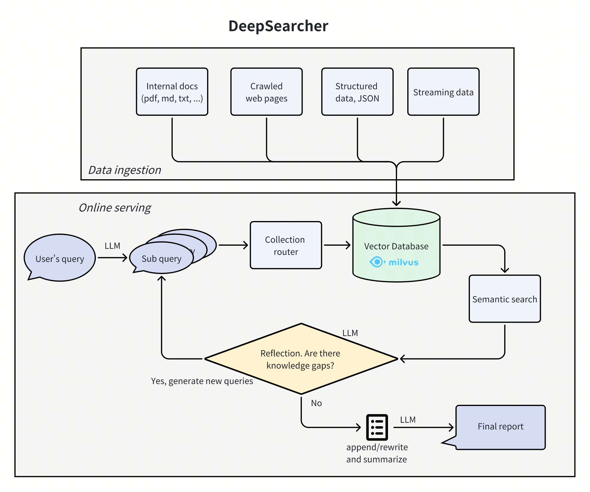
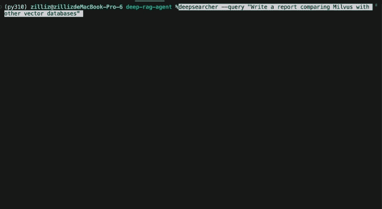

# 🔍 DeepSearcher

  
  
  

---

## ✨ 项目概览

DeepSearcher 结合前沿大语言模型（OpenAI o1、o3-mini、DeepSeek、Grok 3、Claude 4 Sonnet、Llama 4、QwQ 等）和向量数据库（Milvus、Zilliz Cloud 等），基于私有数据完成搜索、评估和推理，提供准确答案与完整报告。

> **适用场景：** 企业知识管理、智能问答系统和信息检索。

## 🚀 核心功能

| 功能 | 说明 |
|------|------|
| 🔒 **私有数据搜索** | 在保障数据安全的前提下充分利用企业内部数据；必要时还可接入网络内容，提高答案准确性。 |
| 🗄️ **向量数据库管理** | 支持 Milvus 等向量数据库，并可通过数据分区提升检索效率。 |
| 🧩 **灵活的 Embedding 选择** | 兼容多种嵌入模型，可根据实际需求选择合适方案。 |
| 🤖 **多种大模型支持** | 支持 DeepSeek、OpenAI 等大模型，用于智能问答和内容生成。 |
| 📄 **文档加载器** | 支持加载本地文件，并提供网页抓取能力。 |

## 🎬 演示

