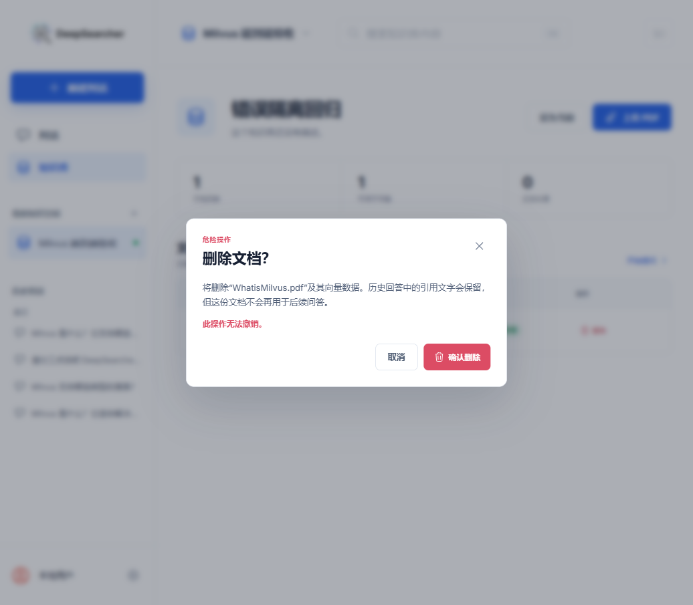

# DeepSearcher 文档删除闭环验证记录

- 验证日期：2026-07-26
- 功能阶段：P1 数据管理
- 验证结论：通过

## 用户流程

知识库文档列表现在提供“删除”操作。点击后显示危险操作确认，明确说明：

- 删除原始 PDF 及其向量数据；
- 历史回答中的引用文字继续保留；
- 被删除文档不会再参与后续问答；
- 删除不可撤销。

确认弹窗默认聚焦“取消”，支持 `Esc` 和点击遮罩关闭。文档处于等待处理或正在处理状态时，删除入口禁用。



## 一致性策略

删除按以下顺序执行：

1. 调用 DeepSearcher API，按文档 SHA-256 删除 Milvus 集合中的全部对应分块。
2. 向量删除成功后，删除 `data/product/uploads/` 中的原始 PDF。
3. 删除产品数据库中的文档和入库任务记录。
4. 历史 Citation 记录保留，外键 `document_id` 自动置空。
5. 刷新文档列表、知识库统计和侧栏状态。

如果向量服务不可用或删除失败，本地文件和数据库记录不会删除，用户可以安全重试。

## 真实验证

在“错误隔离回归”知识库中上传真实 `WhatisMilvus.pdf`，等待处理完成后执行：

1. 打开删除确认弹窗；
2. 点击取消，确认文档仍存在；
3. 再次打开并确认删除；
4. 确认页面文档总数和可用文档数均变为 0；
5. 检查产品数据库，文档记录数为 0；
6. 检查上传目录，原始文件数为 0；
7. 检查对应 Milvus 集合，文档分块数为 0。

另外使用隔离测试集合插入两个文档的三个分块：

```text
删除前：文档 A = 2，文档 B = 1
删除文档 A：delete_count = 2
删除后：文档 A = 0，文档 B = 1
```

这证明删除过滤严格限制在目标文档，不会影响同一知识库中的其他资料。

## 响应式与可访问性

- 取消按钮默认获得焦点；
- 弹窗使用 `alertdialog`、`aria-labelledby` 和 `aria-describedby`；
- 删除按钮具有包含文件名的可访问名称；
- 390 × 844 手机视口下，文档删除入口仍然可见；
- 处理中删除按钮禁用并提供原因说明。

## 自动化结果

```text
Frontend Vitest: 3 files passed, 11 tests passed
TypeScript: npx tsc --noEmit passed
Production build: Vite build passed, 583 modules transformed
Python full regression: 464 passed, 7 skipped
Product delete regression: 8 passed
Live Milvus selective deletion: passed
```

全量 Python 测试保留一个已有的 `Crawl4AICrawler` 未等待协程警告，与本次文档删除功能无关。

## 数据库迁移

本次复用了已有外键和级联关系，没有新增或修改表结构，因此不需要 Alembic 迁移。
