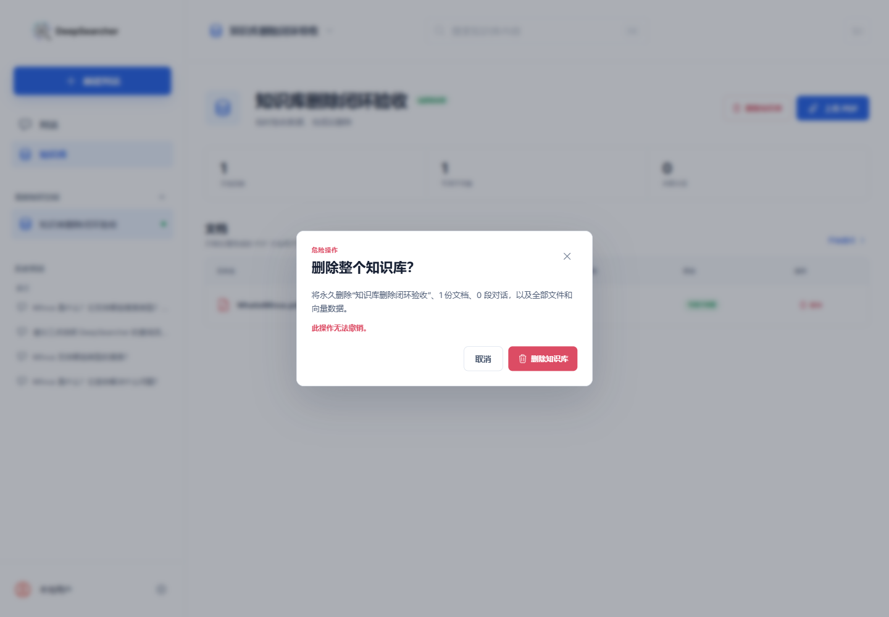
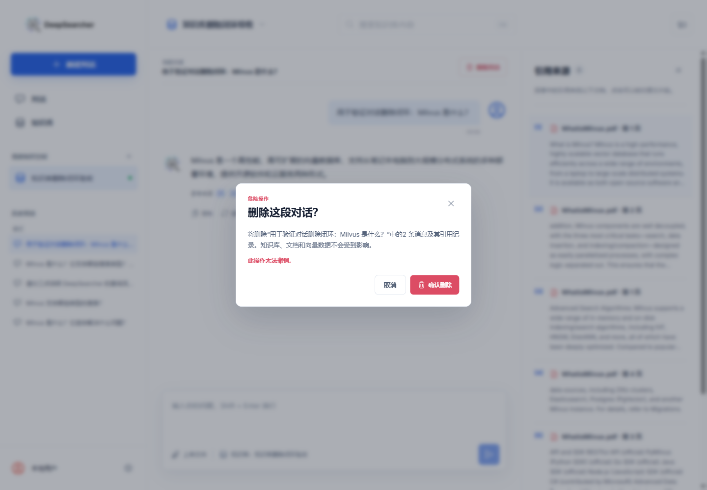

# DeepSearcher 知识库与对话删除闭环验证记录

- 验证日期：2026-07-26
- 功能阶段：P1 数据管理
- 验证结论：通过

## 知识库删除

知识库详情页提供“删除知识库”危险操作。确认弹窗展示知识库名称、文档数和对话数，并明确说明会永久清除原始文件、向量集合和关联数据。

删除顺序为：

1. 拒绝仍有文档处于等待或处理状态的请求；
2. 调用 DeepSearcher API 删除对应 Milvus 集合；
3. 删除知识库上传目录；
4. 删除产品数据库中的知识库，并级联删除文档、入库任务、对话、消息和引用；
5. 若删除的是当前知识库，自动选择最近更新的其他知识库；没有剩余知识库时回到首次使用状态。

向量服务失败时，产品数据库和本地文件不会删除，用户可以重试。由于 Milvus、文件系统和 SQLite 不支持跨系统事务，向量集合删除成功后若文件系统异常，需要在排除文件占用后重试完成本地清理。



## 对话删除

对话页顶部提供“删除对话”操作。确认弹窗展示标题和消息数量，并明确说明只删除当前对话、消息与引用记录，不删除知识库、文档、原始文件或向量数据。

删除成功后：

- 当前对话缓存被移除；
- 历史对话列表刷新；
- 页面回到新对话；
- 当前知识库保持不变。



## 真实验收

浏览器中创建临时知识库“知识库删除闭环验收”，上传并处理真实 `WhatisMilvus.pdf`，随后生成一段带 6 条引用的真实问答。

1. 对话删除弹窗执行取消，确认对话仍存在；
2. 再次确认删除，页面回到新对话，历史项消失；
3. 知识库删除弹窗执行取消，确认文档和知识库仍存在；
4. 再次确认删除，页面自动切换到“错误隔离回归”知识库；
5. 检查 SQLite：知识库、文档和对话记录均不存在；
6. 检查上传目录：知识库目录不存在；
7. 检查 Milvus：对应集合不存在。

另外创建隔离集合 `codex_kb_delete_verify`，通过核心 API 删除后确认 `has_collection` 为 `false`。

## 自动化结果

```text
Python full regression: 471 passed, 7 skipped
Frontend Vitest: 3 files passed, 13 tests passed
Product and Milvus adapter regression: 14 passed, 6 skipped
Core delete API regression: 8 passed
Production build: Vite build passed, 584 modules transformed
Live Milvus collection deletion: passed
Browser knowledge-base deletion: passed
Browser conversation deletion: passed
git diff --check: passed
```

## 数据库迁移

本次复用了已有外键级联和 `SET NULL` 规则，没有修改数据库表结构，因此不需要新增 Alembic 迁移。
