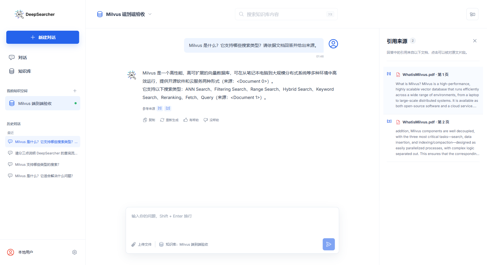

# DeepSearcher 用户工作台端到端验收记录

- 验收日期：2026-07-26
- 验收环境：Windows、Docker Desktop 29.4.1、Milvus Standalone、DeepSearcher API、用户工作台生产构建
- 用户入口：http://127.0.0.1:8600
- 内部 API：http://127.0.0.1:8650
- 真实测试资料：`examples/data/WhatisMilvus.pdf`（56 KB）
- 验收结论：通过

## 验收范围与结果

| 场景 | 操作与预期 | 实际结果 |
| --- | --- | --- |
| 服务启动 | 一键启动后 Docker、Milvus、API、工作台全部健康 | 通过 |
| 创建知识库 | 创建“Milvus 端到端验收”并进入详情页 | 通过 |
| 上传真实 PDF | 上传 `WhatisMilvus.pdf`，状态从“正在处理”变为“可用于问答” | 通过 |
| 当前知识库 | 将验收知识库设为当前，导航和问答区同步更新 | 通过 |
| 真实问答 | 询问 Milvus 定义及支持的搜索类型 | 通过，返回中文答案 |
| 引用核对 | 回答包含可点击引用，并展示文件名、页码和原文片段 | 通过，引用第 1、2 页 |
| 历史记录 | 刷新页面并从历史列表重新进入对话 | 通过，问题、答案及引用完整恢复 |
| 重复文件 | 向同一知识库再次上传相同 PDF | 通过，提示“这个知识库中已经存在相同的 PDF。” |
| 伪 PDF | 上传扩展名为 `.pdf`、但内容无 PDF 签名的文件 | 通过，提示“所选文件不是有效的 PDF。” |
| 空知识库 | 将无文档知识库设为当前并进入问答页 | 通过，输入框和发送按钮禁用，并引导上传 PDF |
| 后端中断 | 问答过程中停止 DeepSearcher API | 通过，提示“问答服务暂时不可用，请稍后重试。”，输入内容保留 |
| 服务恢复 | 重新执行一键启动后检查服务 | 通过，全部恢复健康 |
| 浏览器控制台 | 正常加载生产页面 | 通过，0 errors、0 warnings |

## 真实问答结果

测试问题：

> Milvus 是什么？它支持哪些搜索类型？请依据文档回答并给出来源。

工作台正确回答 Milvus 是高性能、高可扩展的向量数据库，并列出了 ANN Search、Filtering Search、Range Search、Hybrid Search、Keyword Search、Reranking、Fetch 和 Query。回答引用分别指向：

1. `WhatisMilvus.pdf` 第 1 页：Milvus 的定义和部署形态。
2. `WhatisMilvus.pdf` 第 2 页：Milvus 支持的搜索类型。

浏览器证据：



## 验收中发现并修复的问题

### 1. 跨知识库残留上传错误

复现方式：在一个知识库中上传无效 PDF，保持错误提示后直接创建并进入另一个知识库。

修复前：新知识库错误地显示前一个知识库的上传失败信息。

修复：知识库路由参数变化时重新挂载详情页，使上传 mutation 状态严格隔离在当前知识库。

回归结果：新知识库不再显示旧错误。

### 2. favicon 请求返回 404

修复前：首次打开工作台时，浏览器控制台出现 `/favicon.ico` 404。

修复：在 `frontend/index.html` 中显式使用现有 `deepsearcher-badge.png`。

回归结果：全新浏览器会话正常加载时为 0 errors、0 warnings。

## 自动化回归

```text
Frontend Vitest: 3 files passed, 10 tests passed
TypeScript: npx tsc --noEmit passed
Production build: Vite build passed, 583 modules transformed
Python targeted regression: 10 passed
Docker Compose config: valid
Runtime status: Docker, Milvus, DeepSearcher API and User workspace ready
```

## 后续建议

本轮未发现阻断发布的问题。P1 可优先补充知识库/文档删除功能，方便用户管理资料，也便于清理验收数据；随后补充上传失败重试、对话重命名与搜索。
