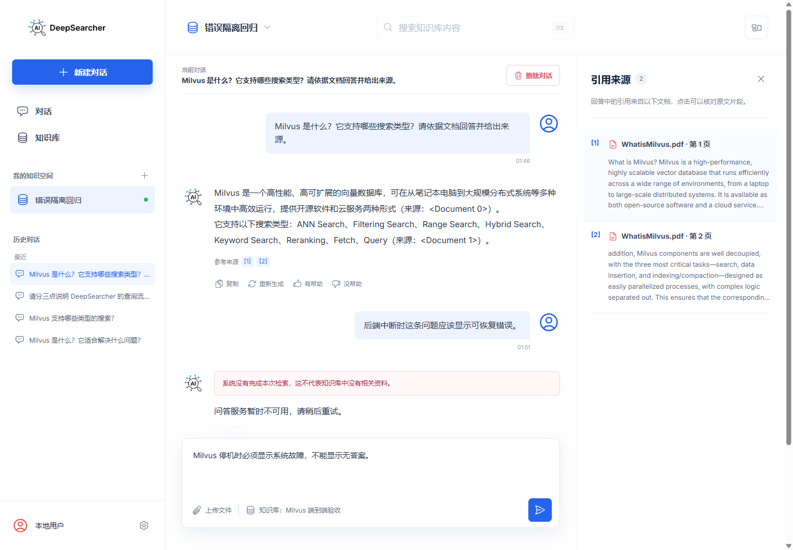

# DeepSearcher 查询失败可见闭环验证记录

- 验证日期：2026-07-30
- 功能阶段：P0 结果可信
- 对应问题：R-01 Milvus 异常可能伪装成空结果
- 验证结论：通过

## 完成范围

查询、入库和集合操作不再把 Milvus 失败转换为空结果。向量适配层统一抛出带 `code`、`operation`、`collection` 和 `retryable` 属性的领域异常，核心 API 再输出稳定、安全的 HTTP 错误协议。

主要错误分类如下：

| 场景 | HTTP | 错误码 | 用户操作 |
| --- | ---: | --- | --- |
| Milvus 暂时不可用 | 503 | `VECTOR_DB_UNAVAILABLE` | 稍后重试 |
| Collection 不存在 | 409 | `VECTOR_COLLECTION_NOT_FOUND` | 返回知识库检查索引 |
| 查询向量维度不匹配 | 409 | `VECTOR_DIMENSION_MISMATCH` | 返回知识库检查索引 |
| 其他初始化、写入、查询或列表失败 | 502 | 对应稳定领域错误码 | 根据 `retryable` 重试 |
| 查询成功但零命中 | 200 | 无错误 | 进入正常无答案流程 |

产品 API 保留核心错误码和可重试标记，并将安全消息保存为 `failed` 助手消息。用户工作台以错误状态展示失败，明确说明“系统没有完成本次检索，这不代表知识库中没有相关资料”，不展示复制和答案评价操作；可恢复错误提供“重新尝试”。

## 故障注入验证

使用隔离集合 `codex_failure_visibility_verify` 验证了四种结果：

1. 有效查询但没有命中时返回空列表；
2. 查询不存在的 Collection 时抛出 `VECTOR_COLLECTION_NOT_FOUND`；
3. 以错误维度查询已有集合时抛出 `VECTOR_DIMENSION_MISMATCH`；
4. Milvus 连接中断时抛出 `VECTOR_DB_UNAVAILABLE`。

隔离集合在验证结束后已删除。

## 真实停机与恢复

在用户工作台已有对话中停止 Milvus standalone 容器并发起真实问题。页面显示：

- “检索服务暂时不可用”；
- “向量检索服务暂时不可用，请稍后重试”；
- “这是系统故障，不代表知识库中没有相关资料”；
- “重新尝试”操作。



恢复 Milvus 后点击重试，请求重新进入正常查询链路并得到正常无答案结果，证明系统故障和真实无命中在同一界面中可以正确转换与区分。验证产生的临时消息已清理，Milvus、核心 API 和用户工作台均已恢复。

## 自动化结果

```text
Python full regression: 485 passed, 7 skipped
Python targeted vector/API/product regression: 36 passed, 6 skipped
Frontend Vitest: 3 files passed, 16 tests passed
Frontend query-failure interaction: 11 tests passed
TypeScript: tsc --noEmit passed
Production build: Vite build passed, 585 modules transformed
git diff --check: passed
Live Milvus zero-hit/missing/dimension validation: passed
Browser Milvus stop/recovery validation: passed
```

全量 Python 测试保留一个既有 `Crawl4AICrawler._async_crawl` 未等待警告，不影响本次结果。

## 后续技术债

本次停机测试再次确认 O-07：`main.py` 在模块导入阶段初始化真实外部组件，因此无 Milvus 时应用导入和 API 单元测试仍会受环境影响。该问题不影响已经运行中的安全错误响应，但应作为下一项架构改造处理。
